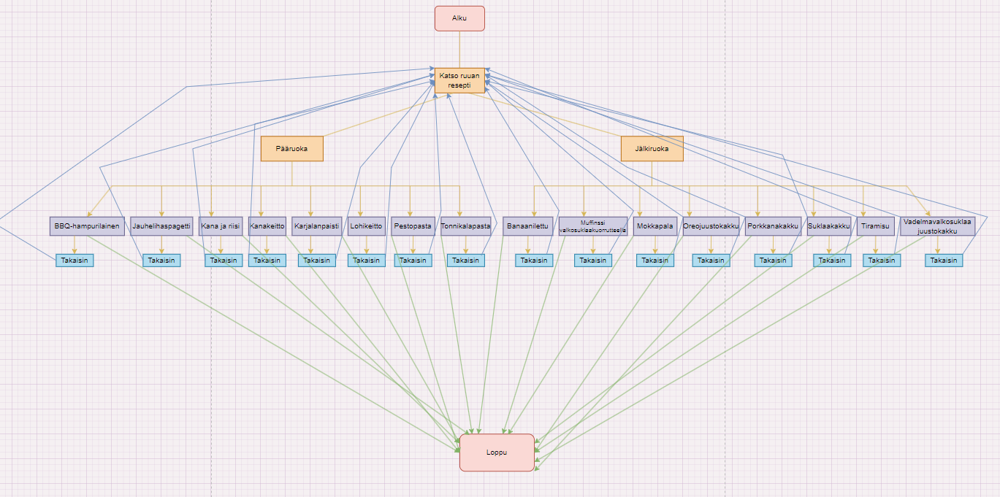

<h1>Näyttötyö</h1>
<h2>Sovelluksen toiminta</h2>

Sovellus toimii siten, että ensimmäiseltä sivulta voi valita reseptin, jonka haluaa valmistaa. Vaihtoehtoina on pääruoka tai jälkiruoka. Kun on valinnut reseptin listboxista, painetaan 'resepti' buttonia. Tämän jälkeen siirryt sivulle, jossa näkyy kyseinen resepti.
Voit aina palata takaisin etusivulle 'takaisin' buttonista, joka löytyy jokaisen reseptin sivulta oikealta ylhäältä.
 

Jos et valitse reseptiä ja painat 'resepti' buttonia, tulee ilmoitus, jossa kehotetaan valitsemaan resepti.

<h2>Vuokaavio:</h2>

<h2>Koodi</h2>

Käytin suurimmaksi osaksi koodissa switch casea. (ALhaalla esimerkki pätkä koodista)

Laitoin jokaiselle formille allanäkyvän koodin takaisin-painikkeelle. Koodi kertoo, että uusi form on form1 (etusivu) ja sen hetkinen form piilotetaan/suljetaan.

<h2>Kehitys</h2>

Sovellusta pystyy kehittämään paljon, mutta itse lisäisin enemmän reseptejä ja panostaisin ulkoasuun enemmän. 
Toiseksi voisi tehdä muutoksen, jossa voi lisätä ja muokata reseptejä.

